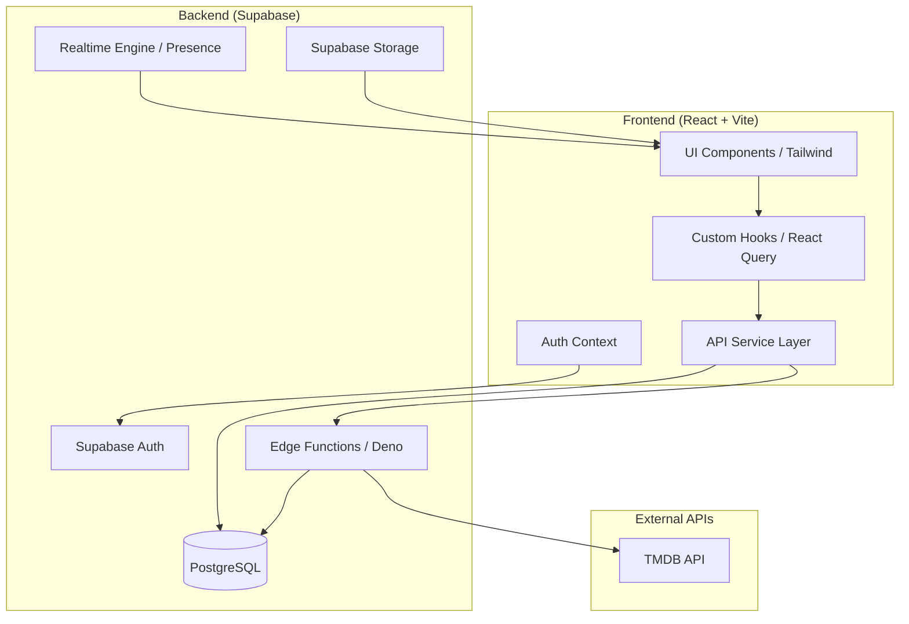
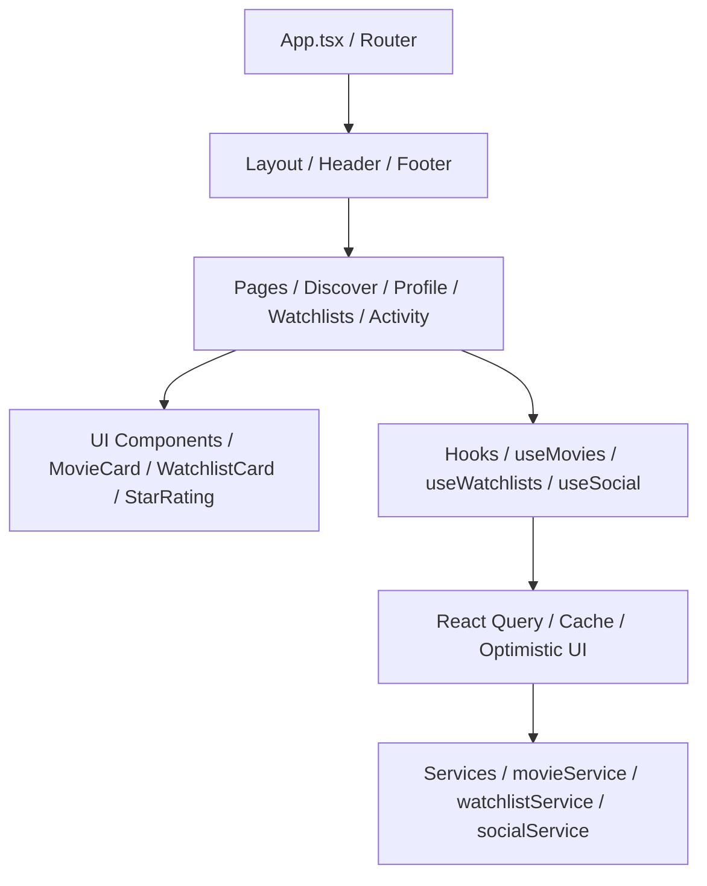
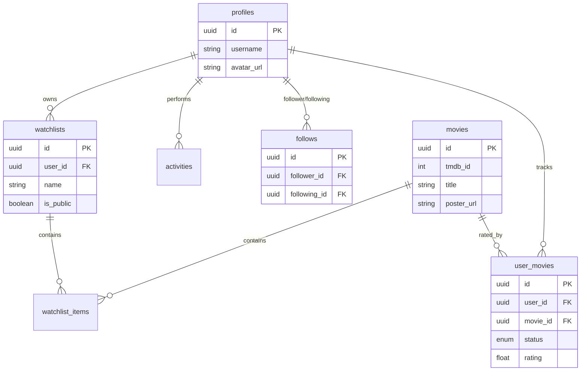

# System Architecture

This document outlines the technical architecture of the Movie Tracker application.

## 🏗️ High-Level Architecture

The application follows a modern decoupled architecture with a React frontend and a Supabase (PostgreSQL + Edge Functions) backend.

---

## 💻 Frontend Architecture

The frontend is built with **React**, **TypeScript**, and **Vite**, focusing on a modular and type-safe structure.

### Component Hierarchy & Data Flow

### Key Technologies:
- **State Management**: React Query (Server State), Context API (Auth/UI State).
- **Optimistic UI**: Implemented for ratings, status updates, and reordering.
- **Drag & Drop**: `@dnd-kit` for watchlist reordering.
- **Real-time**: Supabase Realtime for activity feed and Presence for "Watching Now".
- **Styling**: Tailwind CSS with glassmorphism and custom dark theme.

---

## 🗄️ Backend Architecture

The backend leverages **Supabase** for a serverless, scalable infrastructure.

### Database Schema (Core)

### Serverless Logic (Edge Functions)
- **`sync-movie`**: Orchestrates data between TMDB and our PostgreSQL cache.
- **`search-movies`**: Proxy to TMDB for search results.
- **`discover-movies`**: Advanced filtering and sorting via TMDB.
- **`ai-assistant`**: LLM-powered cinematic assistant for user queries.
- **`ai-recommendations`**: Personalized movie suggestions based on user history.
- **`gamification`**: Logic for XP calculation and achievement unlocking.
- **`collaboration`**: Real-time synchronization for shared watchlists.

### Security (RLS)
All data access is governed by **Row Level Security (RLS)** policies. Social features utilize policies that allow users to see public profiles and activity while protecting private data.
