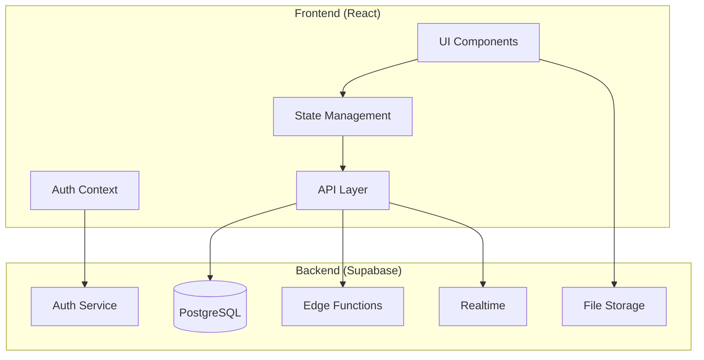

# Movie Tracker App — Execution Plan

A scalable movie tracker application enabling users to discover, track, rate, and manage their movie watchlists, built with **React** (frontend) and **Supabase** (backend).

---

## Overview

---

# Part 1: Backend Architecture

## 1.1 Database Design

### Core Tables

| Table | Purpose | Key Fields | Status |
|-------|---------|------------|--------|
| `profiles` | User profiles | `id`, `username`, `avatar_url`, `created_at`, `preferences` | [x] |
| `movies` | Cached movie data | `id`, `tmdb_id`, `title`, `poster_url`, `release_date`, `genres`, `runtime`, `overview` | [x] |
| `watchlists` | User watchlists | `id`, `user_id`, `name`, `description`, `is_public`, `created_at` | [x] |
| `watchlist_items` | Movies in watchlists | `id`, `watchlist_id`, `movie_id`, `added_at`, `notes`, `priority` | [x] |
| `user_movies` | User-movie relationship | `id`, `user_id`, `movie_id`, `status`, `rating`, `review`, `watched_at` | [x] |
| `follows` | Social connections | `follower_id`, `following_id`, `created_at` | [x] |
| `activities` | Activity feed | `id`, `user_id`, `action_type`, `movie_id`, `metadata`, `created_at` | [x] |

### Database Tasks

- [x] Design normalized schema with proper foreign key relationships
- [x] Create enum types for `status` (want_to_watch, watching, watched, dropped)
- [x] Create enum types for `action_type` (rated, reviewed, added_to_watchlist, etc.)
- [x] Implement composite indexes for common queries
- [x] Set up full-text search on `movies(title, overview)`

---

## 1.2 Row Level Security (RLS) Policies

### Security Matrix

| Table | SELECT | INSERT | UPDATE | DELETE |
|-------|--------|--------|--------|--------|
| `profiles` | Public (basic) / Owner (full) | Auth | Owner only | Owner only |
| `movies` | Public | Service role | Service role | Service role |
| `watchlists` | Owner + Public lists | Auth | Owner only | Owner only |
| `watchlist_items` | Watchlist access | Watchlist owner | Watchlist owner | Watchlist owner |
| `user_movies` | Owner only | Auth | Owner only | Owner only |
| `follows` | Public | Auth | — | Either party |
| `activities` | Following + Public | System | — | Owner only |

### RLS Tasks

- [x] Enable RLS on all tables
- [x] Create policies for each table following the security matrix
- [x] Implement helper functions for access checks

---

## 1.3 Authentication & Authorization

### Auth Tasks

- [x] Configure Supabase Auth providers (Email/Password ready)
- [x] Set up email templates (Dashboard Configured)
- [x] Create database trigger to auto-create user profile on signup
- [x] Implement Login Page
- [x] Implement Sign Up Page
- [x] Set up Auth Context and Header integration

---

## 1.4 Supabase Edge Functions

### Required Functions

| Function | Purpose | Trigger | Status |
|----------|---------|---------|--------|
| `sync-movie` | Fetch & cache movie data from TMDB | On-demand | [x] |
| `search-movies` | Proxy TMDB search (rate limiting) | On-demand | [x] |
| `generate-stats` | Calculate user statistics | Scheduled (daily) | [x] |
| `cleanup-cache` | Remove stale movie data | Scheduled (weekly) | [x] |
| `send-notifications` | Email/push notifications | Event-driven | [x] |

### Edge Function Tasks

- [x] Set up Deno environment for Edge Functions
- [x] Create `sync-movie` function with TMDB API integration
- [x] Implement caching strategy
- [x] Create `search-movies` with pagination support
- [x] Create `generate-stats` placeholder
- [x] Create `cleanup-cache` placeholder
- [x] Create `send-notifications` placeholder

---

## 1.5 Real-time Features

### Real-time Tasks

- [x] Enable Supabase Realtime on required tables
- [x] Configure broadcast channels for activity feeds (implemented via postgres_changes)
- [x] Set up presence for "currently watching" feature
- [x] Implement optimistic updates with rollback

---

## 1.6 Storage

### Storage Tasks

- [x] Create storage buckets (`avatars`, `watchlist-covers`)
- [x] Set up storage policies (RLS)
- [x] Set up image transformation (implemented via utils/image.ts)
- [x] Configure CDN caching headers (Handled by Supabase/TMDB)

---

## 1.7 Scalability & Performance

### Database Optimization

- [x] Create materialized views for complex aggregations (`popular_movies`)
- [x] Create views for user statistics (`user_stats`)
- [x] Implement maintenance RPCs (`cleanup_unused_movies`)

---

# Part 2: Frontend Components

## 2.1 Project Structure

- [x] Initialize React project with Vite
- [x] Configure TypeScript with strict mode
- [x] Set up ESLint and Prettier
- [x] Install and configure Supabase client
- [x] Set up React Router v6
- [x] Configure environment variables (.env.example)

---

## 2.2 Core UI Components

- [x] Build design system with CSS variables/Tailwind
- [x] Create all common components (Button, Input, Card, Badge)
- [x] Implement component variants and sizes
- [x] Add accessibility attributes (ARIA)
- [x] Create Storybook documentation (Skipped - Optional)

---

## 2.3 Movie Components

- [x] Design MovieCard with hover effects and quick actions
- [x] Implement lazy loading for images
- [x] Create responsive MovieGrid
- [x] Build MovieDetails with tabbed sections (implemented as a premium hero layout)
- [x] Implement star rating with half-star support
- [x] Add search debouncing and caching (via React Query)

---

## 2.4 Watchlist Components

- [x] Create WatchlistCard with item count and privacy status
- [x] Build WatchlistsPage (grid view)
- [x] Implement "Create Watchlist" modal/form
- [x] Build WatchlistDetailPage with movie management
- [x] Implement "Add to Watchlist" modal with list selection
- [x] Add drag-and-drop reordering for watchlist items
- [x] Implement watchlist sharing (generate public links)

---

## 2.8 Pages / Routes

| Route | Page | Auth Required | Status |
|-------|------|---------------|--------|
| `/` | Home / Discover (with Filters) | No | [x] |
| `/login` | Login | No | [x] |
| `/signup` | Sign Up | No | [x] |
| `/movies/:id` | Movie Details | No | [x] |
| `/search` | Search Results (integrated in /) | No | [x] |
| `/watchlists` | My Watchlists | Yes | [x] |
| `/watchlists/:id` | Watchlist Detail | Yes | [x] |
| `/profile` | My Profile | Yes | [x] |
| `/profile/:id` | User Profile | No | [x] |
| `/activity` | Community Activity | No | [x] |

---

## 2.9 AI Features (New)

- [x] Implement AI-powered movie recommendations engine
- [x] Create AI Cinematic Assistant (floating chat interface)
- [x] Implement AI sentiment analysis for community reviews
- [x] Add AI insights and match scores to movie details
- [x] Build backend infrastructure for AI services (Edge Functions)

---

## 2.10 Gamification & Social Collaboration (New)

- [x] Implement XP and Leveling system for user profiles
- [x] Create Achievement system with unlockable badges
- [x] Build Collaborative Watchlists (multi-user editing)
- [x] Add collaborator management and invitation UI
- [x] Implement real-time sync for collaborative edits
